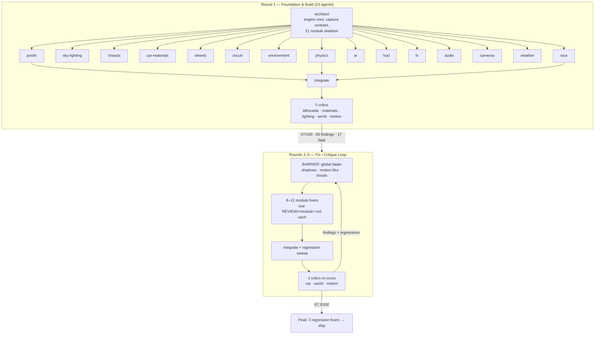

# APEX GP — Build Process

> **A test of the Gauntlet Loop** — <https://somethingbig.ai/gauntlet-loop>

A complete account of how this game was built: the harnesses, the agent topology, the
rounds, the failures, and the cost.

**Task:** build a Formula 1 racing game in Three.js at the quality level of the current
EA/Codemasters F1 titles, using fanned-out sub-agents, with a separate harsh critic agent
scoring frames in a blind comparison against the real game, looping until it stops improving.

---

## 1. The numbers

| | |
|---|---|
| **Elapsed wall-clock** | 38 h 37 m (2026-07-29 11:58 → 2026-07-31 02:35 BST) |
| **Agent wall-clock** | 19.3 h across 10 workflow runs |
| **Workflow runs** | 10, all completed |
| **Agents dispatched** | 137 |
| **Agents completed** | 70 |
| **Agents killed by infrastructure** | 67 |
| **Sub-agent tokens** | 22,039,664 |
| **Sub-agent tool calls** | 10,664 |
| **Game source** | 42,795 lines across 23 modules |
| **Permanent harness** | 327 lines (3 tools) |
| **Agent-written diagnostics** | 136 throwaway scripts, 6,488 lines |
| **Screenshots captured** | 2,031 PNGs (3.3 GB) |
| **Git commits** | 15 |
| **Critic score** | 47 → 58.3 → 64.0 → 67.3 / 100 |
| **Ships** | build green · **14/14 playability** · **15.66 ms** @1080p · 0 console errors |

Note the ratio that matters most: **67 of 137 agents were killed by session limits or API
500s, not by the work.** Every round was checkpointed to git precisely because half of them
died. Recovery cost a relaunch instead of hours.

---

## 2. The central problem, and the thing that solved it

An agent cannot judge "does this look AAA?" from source code. The entire task hinges on
agents *seeing* their own output. So before dispatching anything, the first job was a
verification harness — and it had to run on the **real GPU**, because software-rendered
WebGL would misrepresent exactly the things under review (reflections, shadow filtering,
bloom, tonemapping).

Three permanent tools were built, each in response to a specific failure discovered during
the run. They are the reason the loop converged at all.

### `tools/shot.mjs` — deterministic GPU capture (124 lines)

Launches Chrome-for-Testing headless against **ANGLE Metal on the M3 Max** — verified, not
assumed: the harness prints `RENDERER: ANGLE (Apple, ANGLE Metal Renderer: Apple M3 Max)`.

Two non-obvious problems it solves:

1. **A WebGL page never goes idle.** `page.screenshot()` waits for compositor stability and
   therefore hangs forever on a continuously-rendering canvas. Capture goes through the CDP
   `Page.captureScreenshot` command instead, which does not wait.
2. **Frames must be reproducible across rounds.** The page exposes a `window.__APEX__`
   contract: `pause()` halts the rAF loop, then the harness drives `renderFrame(i)` manually
   at a fixed 1/60 dt. Nine named camera poses (`chase`, `cockpit`, `tv`, `beauty`, `wide`,
   `grid`, `wheel`, `front`, `hud`) put the sim in an identical state every time, so a critic
   in round 5 is scoring the same framing as in round 2.

### `tools/probe.mjs` — live engine state (96 lines)

Built in round 3, when a critic claimed the ground cast no shadows and I could not tell from
a screenshot whether the system was broken or the sun was simply behind the camera. It
reports, from the running page: shadow-map state, every light and whether it casts, per-mesh
`castShadow`/`receiveShadow`/`shadowSide` counts, sun elevation, material types, and a
framebuffer luminance histogram of the ground plane.

### `tools/compare.mjs` — regression detector (107 lines)

Built in round 5, in response to a measured pattern: rounds 3 and 4 each fixed their fatal
defects and introduced ~14 regressions. **Nearly half the team's effort was spent undoing its
own damage.**

It decodes two captures of the same shot through ffmpeg and reports, per grid cell:

- **luma** — brightness change (exposure, lighting, shadow)
- **sat** — saturation change (hue drift, e.g. carbon going cobalt blue)
- **edge** — gradient energy (**detail gained or lost**)

Edge energy is the load-bearing metric: it catches a "fix" that quietly *flattens* something
elsewhere, which is how nearly every regression happened. It was validated against a
regression the critics had already measured by hand, and independently reproduced their
numbers (sky cells: +11.7pp saturation, −19.2 luma).

From round 5 it became a **mandatory gate** — every agent had to run it against the previous
round's frame and paste the output before claiming done, under the rule:

> "I improved X" is not an acceptable answer to "you flattened Y."

### The 136 tools the agents built for themselves

Unprompted, agents wrote their own single-purpose instruments to answer questions the shared
harness could not: `_smdump.mjs` (dump compiled shadow-map GLSL off the GPU), `_l5ratio.mjs`
(sun-to-ambient illuminance ratio), `_c5vel.mjs` (per-object screen-space velocity),
`_zroadab.mjs` (road-material A/B), `_race-soak.mjs` (long-run race-state soak test),
`_play.mjs` (drive the car through a scripted input sequence). 6,488 lines of throwaway
diagnostics. This is what "measure, don't guess" looked like in practice.

---

## 3. Agent topology

Every round used the same shape: a **barrier phase** for global-impact defects that would
corrupt everyone else's judgment, then a **wide parallel fan-out** on strictly disjoint
files, then integration, then critics.



### Why a barrier, when pipelining is normally better

Three times a single defect made every other lens unjudgeable:

- **Round 2** — an exposure blowout turned every sun-facing frame ~60% pure white.
- **Round 3** — the ground cast no shadows, so *every* world/car/motion judgment was
  contaminated.
- **Round 5** — the flank reflection was the named blind-test decider for three rounds running.

Fixing those first, alone, before anyone else ran, was worth more than the wall-clock a
pipeline would have saved.

### File ownership, not worktrees

Git worktrees were rejected: they don't carry `node_modules`, which breaks vite for every
agent. Instead each agent got **exclusive file ownership** plus **its own dev-server port**
(5200, 5201, 5202…). Cross-module edits were permitted only as minimal additive hooks, and
had to be reported. Transient breakage from a sibling mid-edit was handled by "wait 20s and
retry; report it, don't fix it."

### Routing findings to owners

Critics returned structured JSON (`severity`, `module`, `defect`, `fix`). A script grouped
those by owning file into `REVIEW/<module>.md` — so a fixer received only its own worklist
plus the shared regression list, never 70 KB of irrelevant findings.

---

## 4. Round by round

### Round 0 — Harness (me, not delegated)

Scaffolded vite + three@0.185.1, built `shot.mjs`, and **smoke-tested the whole loop
end-to-end before dispatching a single agent** — rendered a torus knot, captured it, read the
PNG back. Two bugs found here that would have poisoned everything: the wrong Chromium path
(the cached Playwright binary is `Google Chrome for Testing.app`, not `Chromium.app`), and
the screenshot hang.

### Round 1 — Foundation + 15 subsystems

Architect wrote the engine core and a driveable prototype across 21 modules; 15 specialists
then deepened disjoint subsystems. **Session limit killed 22 of 23 agents** — but at the
*end* of ~1.9 h of work, so their file edits had already landed. 20,601 lines survived and
built clean.

### Round 2 — The blowout

Every sun-facing frame was blown white. The `tv` shot — pointing *away* from the sun — looked
fine, which localised the fault to bright-value handling rather than the scene.

The fix agent measured instead of guessing, and found **four compounding faults**:

1. The cloud shader's single-scattering albedo evaluated to **182**. `S = (direct+ambient)*d`
   divided by `ext = d*uCloudAbsorption` cancels density and leaves `1/0.0055`. It scaled with
   step length, so grazing horizon rays — exactly what a chase cam looks along — got the worst
   of it, and an HG forward lobe at `g=0.78` peaked another 11.7×. Those clouds were also
   poisoning the PMREM bake, inflating scene ambient ~4×.
2. The bloom upsample chain was unnormalised additive — six levels handed the composite **6×**
   the thresholded energy. Bloom mip0's mean (2.24) was *higher than the scene's* (0.87).
3. Bloom threshold and clamp were in pre-exposure units, so the clamp never fired.
4. `toneMappingExposure` was calibrated against the inflated ambient.

**Result: 47/100** from the first critic panel.

### Round 3 — 65 findings, 17 fatal

Critics scored **car 45 / world 42 / motion 54** and diagnosed at code level:

> Every painted panel is covered in a dimple at ~20–35 cm pitch. `paintRelief()` adds
> `gridSample(wob,…)*0.09` where `wob` is `fbm(freq:7, octaves:3)`; body u spans 5.45 m so
> freq 7 is a 0.78 m fundamental, amplitude 0.09 through `heightToNormal(…,3.4)` — an effective
> slope of ~0.2 where real carbon panel waviness is ~0.0007. **About 300× too much.**

The lighting fixer then **disagreed with its critic and was right**: it rejected the
prescribed fix ("centre every cascade on the focus") as something that would destroy the
cascade, and found two defects the critic missed — casters were rendered **back-face only**,
so a tyre standing on tarmac wrote its *underside*, coincident with the ground, where no bias
can ever produce a contact patch; and sun-to-ambient was 3.0:1 where clear sky at 49° is
~6.5:1, so a perfect shadow could only ever be 1.6 stops deep.

**47 → 58.3.**

### Round 4 — The shadow argument

The world critic proved with a debug flag that the racing surface still rendered 100% lit. I
probed the materials and proposed a mechanism: every ground mesh had a non-null
`onBeforeCompile`, which is a **single slot** — `lighting.js` installs a CSM injection,
`circuit.js` later assigns its asphalt hook, silently destroying it.

**The fixer disproved me.** It dumped the real compiled fragment shader off the GPU via
`gl.getShaderSource()` and showed `TrackSurface` contained `#define USE_CSM`, the unrolled
4-cascade loop, *and* the asphalt injection in the same shader — because CSM is installed by
patching `THREE.ShaderChunk`, not per-material. It then built four new debug modes to
establish an evidence chain (maps populated → shadow term 0 in umbra → factor reaching
`directLight.color` → `bias=0` changes nothing) and found the true cause: **the key light was
too weak**, and `?csmdbg=2` — the critic's own instrument — lies.

**58.3 → 64.0.** Verified myself: every car now rakes a readable shadow.

### Round 5 — Three rounds of failure explained

The flank reflection had been named the blind-test decider three rounds running and never
fixed. The cause was that **it was never being tested**: `capture()` runs the weather state →
`weather.setState` calls `carMaterials.setWetness()` → which **rewrites `userData.envGain`
outright**. Every prior A/B sweep produced identical frames — "a gain of twenty is
pixel-identical to a gain of zero." The same function also wrote the gain raw, bypassing
`ENV_SPEC_NORM`, so the shipped value was never the constant in the file.

Similarly, the kerbs — logged as "still a decal" for three rounds — **had ribs all along**.
Round 4 built them and set `castShadow = false`, reasoning "a 5 cm step throws a 5 cm shadow
nobody sees": true of the footprint, wrong about *self*-shadowing.

**64.0 → 67.3.**

Then the critic found the root cause of the paint problem, which no amount of material tuning
would ever have fixed:

> 59.8% of the red bodywork pixels have R ≥ 250 and 61.9% have G ≤ 6. The paint is
> channel-clipped, so any specular term is **mathematically invisible**.

The base albedo sat at 254/0/8 — pinned against the top of red and the bottom of green. No
headroom for a highlight, no room for a dark reflected-track band. Every fix aimed at
`envMapIntensity`, `metalness` and `clearcoat` had been working correctly and being clipped
away.

### Final round — Regressions, then ship

Scoped to the four measured regressions (clipped paint, carbon overshooting into khaki, front
wing collapsing to a black mass at −37.3% edge energy, grass going fluorescent chartreuse and
leaking into the IBL), then playability, performance and docs.

**The clipped-paint root cause turned out to be a category error.** The team's brand hex
`#c8102e` was being used directly as a *reflectance*: 0.578 linear in red against 0.005 in
green. A sunlit diffuse term plus a metallic-basecoat specular on top of that pins the top of
red and never leaves the bottom of green — which is why three rounds of `envMapIntensity` /
`metalness` / `clearcoat` each moved the flank by about one code value. The fix separates the
two meanings: `team.primary` stays the *display* colour (HUD dot, timing tower, hoardings,
crowd kit all read it), and a new `team.basecoat` `#7e1f27` is what the body is actually
*painted* with — same hue, red at 0.36 of its linear value, green lifted 2.6× off zero.

**A dead control was found by insisting on real playability testing.** `E`/`Q` manual
shifting was documented and wired in `vehicle.js`, but `engine.js` hard-coded
`autoGearbox: true` and never forwarded the actions. Measured before the fix: at 309 km/h in
8th, `Q` → still 8th. This had survived five rounds of visual critique because **screenshots
cannot catch it** — the capture harness drives via autopilot. It was only caught by the ship
agent driving the car with real key events for 67 seconds.

The regression sweep found 18 changed cells across the nine shots and correctly triaged them:
one genuine regression (the world-colour fix had shipped a second, unreported change pushing
individual trees from ~138 m to 300 m, emptying the establishing shot's mid-ground — swept the
threshold and shipped 200 m), with the rest explained as *intended* losses of detail. The
`wheel` shot's 7 cells of "lost edge energy" were the removal of round 5's coral-like normal
noise: **losing that edge energy was the deliverable, not a regression.** That distinction —
between detail lost and noise removed — is the one thing `compare.mjs` cannot decide on its
own, and it needed a human-style judgement call every time it fired.

---

## 5. Score trajectory

```
        R2      R3      R4      R5
car     45  →   56  →   58  →   63
world   42  →   53  →   62  →   64
motion  54  →   66  →   72  →   75
────────────────────────────────────
avg     47  →  58.3  →  64.0  →  67.3
        (+11.3)  (+5.7)  (+3.3)
```

Calibration given to every critic: **100 = indistinguishable from F1 25. 90 = a viewer might
pick either. 70 = obviously a good browser game. 50 = clearly a hobby project.** They were
told most first attempts deserve 40–65 and that a soft score wastes everyone's time.

Gains decelerated every round (+11.3, +5.7, +3.3). That is the honest signal: the loop was
approaching a plateau in the high 60s / low 70s.

---

## 6. Where the process was wrong

Recorded because it is the most useful part of the account.

| Claim | Made by | Reality |
|---|---|---|
| "Shadows are still absent" | me, from a 1600×900 thumbnail | Contact shadows *were* present; a 3× crop showed them. The downsample hid them. |
| "The flank is still matte red" | me, same mistake | A 4× crop showed a clipped-white specular streak along the sidepod shoulder. |
| "`onBeforeCompile` collision is destroying the CSM injection" | me | Disproved by dumping the compiled shader. CSM patches `ShaderChunk` globally. |
| "Centre every cascade on the focus" | a critic | Would have destroyed the cascade. The fixer refused, correctly. |
| "The racing surface is 100% lit, proven by `?csmdbg=2`" | a critic | The debug mode itself was wrong. |
| "Edge energy is up 48.3% — a win" | my own tool | The critic rejected it: *"Detail gained is not the same as detail that reads."* The new edges were bubble-wrap tree canopies. |

**Three of my own six calls were wrong, and every one came from judging a downsampled
full-frame thumbnail.** From round 5 onward the harness instruction became: crop at 3× before
judging fine detail. The critics — who crop and measure pixel values — were consistently more
reliable than my glance, which is why their scores are worth more than my impression.

---

## 7. Infrastructure

Nine runs, five interrupted:

| Run | Agents | Done | Killed | Cause |
|---|---|---|---|---|
| `w2mrku663` | 23 | 1 | 22 | session limit |
| `w9nclsufa` | 9 | 1 | 8 | API 500s |
| `w2ddd3hzn` | 11 | 11 | 0 | — |
| `wki0s2ngn` | 16 | 3 | 13 | session limit |
| `wxc646izj` | 16 | 16 | 0 | — |
| `waqlondlw` | 14 | 2 | 12 | session limit |
| `wbjo2ecui` | 14 | 14 | 0 | — |
| `wat0unqap` | 15 | 3 | 12 | session limit |
| `wr25ezt1y` | 15 | 15 | 0 | — |
| `wbae1h075` | 4 | 4 | 0 | — |

**The recovery pattern that made this survivable:**

1. Commit to git after every round — 12 commits, each a rollback point.
2. Relaunch with `resumeFromRunId`. Completed agents replay from cache instantly; only the
   killed ones re-run. A round interrupted at 90% cost one relaunch, not 2 hours.
3. Edit the script between attempts to inject freshly-observed defects, keeping earlier
   prompts byte-identical so their cache entries survive.

One interruption caused real damage: a session limit killed an agent mid-edit and left
`postfx.js` unparseable — it had written `` `chase` `` in backticks **inside a GLSL template
literal**, terminating the JS string. Fixed by hand; a permanent warning was then added to
every subsequent agent prompt.

---

## 8. What exists

23 modules, 42,783 lines, **fully procedural — no downloaded assets, runs offline from
source.**

| Module | Lines | |
|---|---|---|
| `track/environment.js` | 6,753 | terrain, barriers, fencing, grandstands, crowd, pit lane, props |
| `game/race.js` | 3,379 | weekend structure, timing, flags, safety car, pit stops, front end |
| `car/wheels.js` | 2,575 | tyres, rims, brakes, full double-wishbone linkage |
| `car/chassis.js` | 2,564 | front wing, halo, sidepods, floor, rear wing + DRS |
| `track/circuit.js` | 2,513 | centreline spline, lofted road, extruded kerbs, racing line |
| `camera/cameras.js` | 2,486 | chase, cockpit, T-cam, TV broadcast ring, replay |
| `weather/weather.js` | 2,383 | wet track, drying line, rain, spray |
| `render/postfx.js` | 2,283 | bloom, GTAO, motion blur, DOF, TAA, grade |
| `fx/particles.js` | 2,213 | smoke, sparks, spray, dust, heat haze |
| `core/engine.js` | 1,900 | renderer, fixed-timestep loop, capture contract |
| `hud/hud.js` | 1,805 | broadcast HUD, timing tower, minimap |
| `render/sky.js` | 1,767 | atmospheric scattering, volumetric clouds |
| `audio/engine.js` | 1,571 | WebAudio V6 turbo-hybrid synthesis |
| `render/lighting.js` | 1,496 | sun, PMREM IBL, 4-cascade shadows |
| `physics/vehicle.js` | 1,478 | Pacejka tyres, aero, ERS, differential |
| `car/materials.js` · `livery.js` | 2,683 | carbon, clearcoat paint, 10 liveries |
| `ai/opponents.js` | 1,144 | racing line, 19-car field, overtaking |
| `textures/procedural.js` | 1,115 | shared procedural texture library |
| others | 3,275 | input, assets, rng, main |

---

## 9. Honest assessment

### It runs

| | |
|---|---|
| Build | green — 181 ms, 1.62 MB / 508 kB gzip, zero errors |
| Playability | **14/14** driven in a real browser with real key events |
| Frame time @1080p | **15.66 ms** mean on `chase` (in budget); `tv` 11.06, `cockpit` 19.71, `hero` 22.41 |
| Console | **0 errors** over 67 s of mixed input, and across all nine capture shots |

Verified: throttle 0 → 15.9 m/s in 3 s; braking 5.2 → 0.0; steering yaw signs match
`CONTRACT.md`; DRS activates at 303 km/h in-zone and releases; ERS drains under deployment;
the 19-car AI field races (leaders 358–408 m in 6 s, 17/19 changed line); five-light start
sequence; lap and sector timing rolls over correctly; 20 timing-tower rows and 20 minimap dots
update live; 7 camera modes cycle.

Sim cost is only 0.7–0.9 ms — it is all GPU. The top cost is the sky raymarch at 4.03 ms
(AO 2.19, shadows 1.98). The ship agent confirmed there was no waste to reclaim there (drawn
once per frame, casts no shadows, excluded from the G-buffer, IBL not re-baked) and
deliberately **did not cut it**, because the remaining cost is the genuine 128-step cloud
march and sky/AO/shadows are exactly the quality the critics credited. Documented rather than
bought — the right call.

### It does not look like F1 25

**67.3/100** on a scale where 90 means a neutral viewer might pick either frame in a blind
test. The critics never said otherwise. The last blind comparison:

> A neutral viewer picks the real F1 25 frame, and at `wheel` they do it in under a second,
> on the tyre.

What genuinely landed: the circuit reads as a grand prix venue; ground shadows are correct
and readable; kerbs are real extruded castings that self-shadow; the HUD was called
"something I'd genuinely accept on a broadcast overlay"; subject separation under motion blur
works; and the paint finally has tonal range instead of a clipped vector-red flank.

What did not: car materials remain the weak axis (63) — the carbon has oscillated from cobalt
to khaki without settling on graphite, and the tyre only got its three-zone roughness in the
last round. Foliage is spheres, not leaf cards.

The structural ceiling is that **everything is procedural geometry and procedurally-generated
textures with no authored art**. A shipped F1 title has scanned cars, photogrammetry-derived
circuits and hand-authored materials. Closing the last 20 points is an art-asset problem, not
a code problem — which is exactly what the score decelerating from +11.3 to +5.7 to +3.3 per
round was telling us.

### What the loop was actually good at

Not "making it prettier". Its real output was **eight root causes that no amount of
parameter-tuning would have found**, each located by an agent that measured instead of
guessing: the albedo-182 cloud term, the 6× unnormalised bloom chain, back-face-only shadow
casters, the 3.0:1 sun-to-ambient ratio, `setWetness` silently invalidating every A/B test of
the flank reflection, `castShadow = false` on kerbs that already had ribs, a brand hex used as
a reflectance, and a hard-coded `autoGearbox` masking a dead control.

Five of those had survived multiple rounds of confident, wrong fixes aimed at the symptom.

The structural ceiling is that **everything is procedural geometry and procedurally-generated
textures with no authored art**. A shipped F1 title has scanned cars, photogrammetry-derived
circuits and hand-authored materials. Closing the last 20 points is an art-asset problem, not
a code problem — which is exactly what the score decelerating from +11.3 to +3.3 per round
was telling us.

---

## 10. How to run it

> Also in [`README.md`](README.md), which is the front door for the project itself.
> This section is the same guide, kept here so this document stands alone.

### Play the game

```bash
cd /Users/work/Projects/YouTube/2026-07-29/f1
npm install
npm run dev
```

Open **<http://localhost:5173>**. The loading overlay reads `BUILDING CIRCUIT…` while the
sky, IBL and procedural textures are generated — first load takes a few seconds because every
asset is built in-browser at startup. There are no files to download.

Requires a WebGL2 browser with hardware acceleration. Developed and measured against Chrome
on an Apple M3 Max.

### Controls

| Action | Keys |
|---|---|
| Steer left / right | `←` `→` or `A` `D` |
| Throttle | `↑` or `W` |
| Brake | `↓` or `S` |
| Shift up | `E` or `Right Shift` |
| Shift down | `Q` or `Left Shift` |
| DRS | `F` |
| ERS deploy | `R` |
| Cycle camera | `C` |
| Look around | `V` (hold) |
| Reset to track | `X` |
| Pause | `P` |
| Debug overlay | `Tab` (hold) — fps, draw calls, triangles, sim/render ms, camera mode |

A gamepad is supported with analog steering, throttle and brake if one is connected.

### Production build

```bash
npm run build      # bundles to dist/
npm run preview    # serve the built bundle
```

### The tooling

All three tools drive a real GPU-accelerated headless Chrome and require the dev server to be
running.

```bash
# 1. Deterministic capture — nine fixed camera poses, identical sim state every run.
#    Shots: chase cockpit tv beauty wide grid wheel front hud
npm run shot -- --out shots/x.png --shot beauty --w 1600 --h 900 --warm 150

# 2. Live engine state — shadow maps, lights, per-mesh cast/receive counts,
#    sun elevation, material types, ground luminance histogram.
npm run probe -- --shot grid

# 3. Regression detector — per-cell luma / saturation / edge-energy deltas
#    between two captures of the same shot. Negative edge = detail lost.
npm run compare -- shots/before.png shots/after.png --grid 6
```

Debug visualisations are exposed as URL parameters, e.g.
`http://localhost:5173/?csmdbg=2` paints the shadow test and `?csmdbg=1` paints the selected
shadow cascade. See the header of `src/render/lighting.js` for the full list.

### Where things live

`CONTRACT.md` is the module map and the public API of every subsystem — read it first if you
intend to change anything. `STATUS.md` tracks per-module state and the ranked remaining
weaknesses. `REVIEW/*.md` holds the critic findings routed to each owning module.
