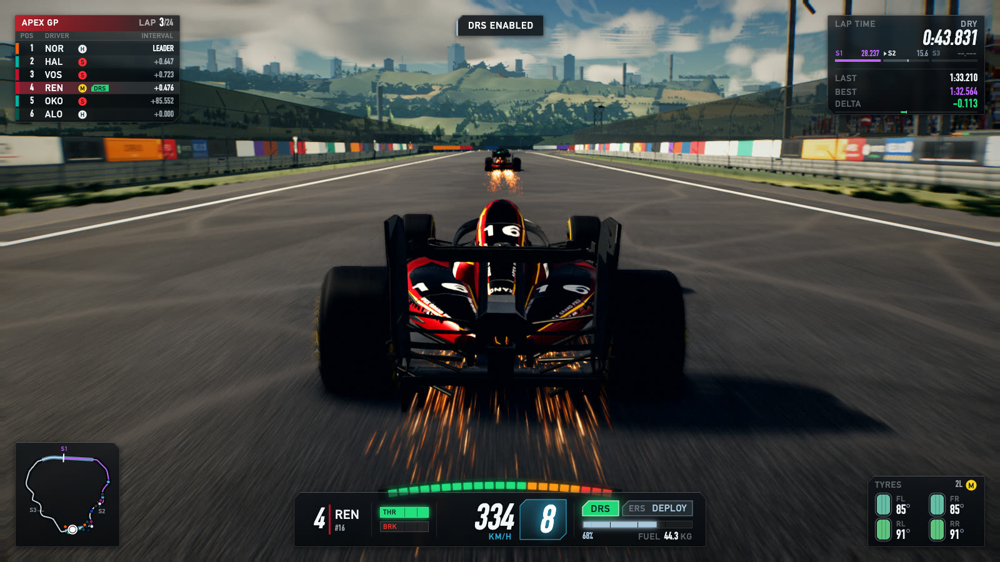
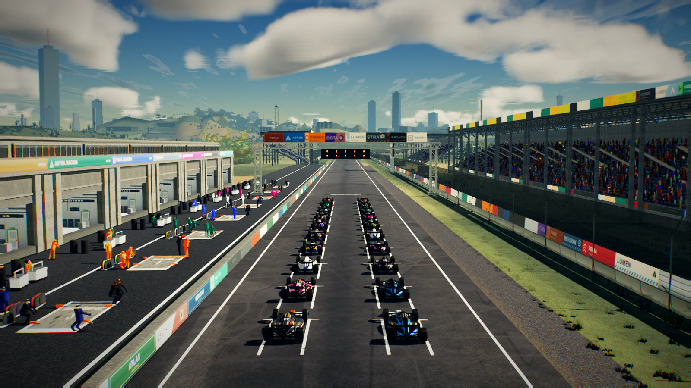
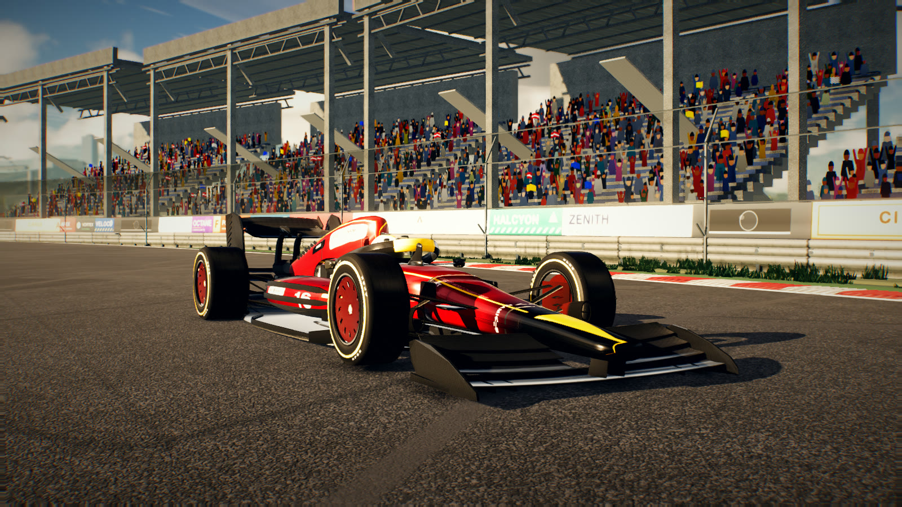
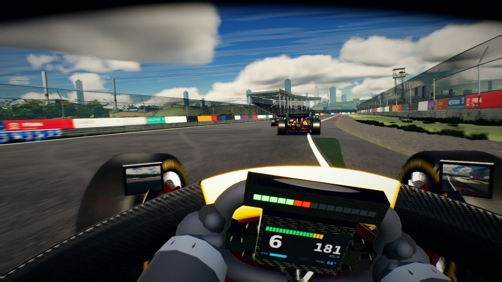
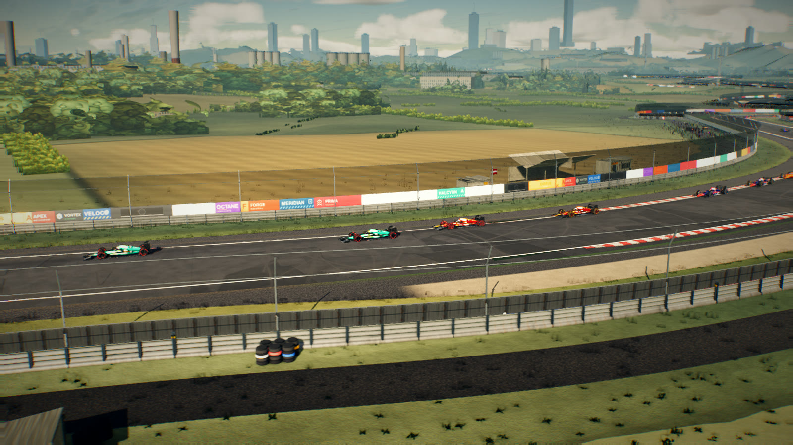

# APEX GP

> **This repository is a test of the Gauntlet Loop** —
> <https://somethingbig.ai/gauntlet-loop>
>
> The game was built by fanned-out sub-agents writing the code, with separate
> harsh critic agents scoring every frame in a blind comparison against the real
> F1 games and feeding measured defects back in, looping until the score stopped
> moving. It took **137 agents, 22.0M tokens and 19.3 hours** of agent
> wall-clock over 10 rounds, and finished at **67.3/100** where 90 means a
> neutral viewer might pick either frame.
>
> [`PROCESS.md`](PROCESS.md) is the full account: every harness built, the agent
> topology, the round-by-round scores, the eight root causes the loop found, and
> the six times the process was confidently wrong.

A Formula 1 racing game built in [three.js](https://threejs.org/), where **every
byte of content is generated in code**. There are no model files, no textures on
disk, no audio samples and no network requests. The circuit, the cars, the sky,
the crowd, the tyre marbles and the engine note are all synthesised at boot from
a seeded PRNG, so the whole thing runs offline from source.

You race a 20-car field over 24 laps of a 5.66 km circuit, with lap and sector
timing to the millisecond, DRS zones, ERS deployment, tyre wear and a broadcast
timing tower.



| | |
|---|---|
|  |  |
| The standing grid — 20 cars, five-light start | Hero car — procedural livery and carbon |
|  |  |
| Onboard, with halo and live mirrors | Establishing shot over the circuit |

---

## Run it

Requires Node 18+ and a browser with WebGL2.

```bash
npm install
npm run dev          # vite dev server, prints a localhost URL
```

Open the URL it prints. The first load spends a second or two on
`BUILDING CIRCUIT…` while the procedural bake runs, then drops you straight into
the pre-race lights sequence.

```bash
npm run build        # production bundle into dist/
npm run preview      # serve the built bundle
```

With no input the player car drives itself using the same AI as the field
(attract mode), so the game always shows a convincing lap. Touch any control and
you take over.

---

## Controls

| Key | Action |
|---|---|
| `W` / `↑` | Throttle |
| `S` / `↓` | Brake |
| `A` / `←` | Steer left |
| `D` / `→` | Steer right |
| `E` / `Right Shift` | Shift up |
| `Q` / `Left Shift` | Shift down |
| `F` | DRS (only opens inside a DRS zone, above ~47 km/h, off the brakes) |
| `R` | ERS deploy |
| `C` | Cycle camera — chase → cockpit → halo → T-cam → bumper → TV → hero |
| `V` | Look back |
| `X` | Reset to the racing line |
| `P` | Pause |
| `Tab` (hold) | Debug overlay — fps, draw calls, triangles, sim/render ms, camera |

The gearbox is **automatic until you touch it**. The first `E` or `Q` press
latches manual mode for the rest of the stint; `X` hands it back to the auto box.

Gamepads work too: left stick steers, triggers are throttle/brake, bumpers shift,
`A` is throttle, `X`/`Y` are DRS/ERS.

### Debug flags

Append to the URL:

```
?fx=0                     bypass the whole post stack (raw render)
?ao=0&bloom=0&look=0      toggle individual passes (also dof, smaa, preGrade)
?env=0.6                  scale IBL intensity
?exposure=1.2             exposure override
?fog=0                    disable fog
?obcaudit=1               report any material whose onBeforeCompile got clobbered
```

Isolating a pass this way is the fastest route to "why is my frame white".

---

## Architecture

`CONTRACT.md` is the binding interface document — units, axes, the car-local and
track coordinate frames, wheel ordering, render layers, the procedural-texture
API and the capture contract. Fifteen specialists worked this tree in parallel;
anything written in `CONTRACT.md` is a promise other modules rely on. **Read it
before changing a signature.**

| Module | Role |
|---|---|
| `src/main.js` | Entry point: loading overlay, boots the engine, debug HUD |
| `src/core/engine.js` | Renderer, scene, fixed-timestep loop, `window.__APEX__` capture contract |
| `src/core/input.js` | Keyboard/gamepad → one normalised control state; edge-latched actions |
| `src/core/assets.js` | Procedural asset registry — bakes once, disposes as a unit |
| `src/core/rng.js` | Seeded PRNG. **No `Math.random` anywhere else**, so captures reproduce |
| `src/physics/vehicle.js` | Tyre/aero/gearbox/ERS vehicle dynamics, slip-based grip |
| `src/ai/opponents.js` | AI drivers, racecraft, the 19-car opponent field |
| `src/game/race.js` | Race control: lights, flags, laps, sectors, pit stops, standings |
| `src/track/circuit.js` | Circuit geometry and the arc-length track sampling API |
| `src/track/environment.js` | Everything off the racing surface: terrain, woodland, stands, crowd, pit lane |
| `src/car/chassis.js` | Current-regulation F1 body geometry |
| `src/car/wheels.js` | Tyres, rims, brakes, double-wishbone suspension linkage |
| `src/car/livery.js` | Team liveries, body surface maps, numbers, decals |
| `src/car/materials.js` | Car material library (paint, carbon, rubber, metal) |
| `src/render/sky.js` | Physically based atmosphere + raymarched cumulus, time of day |
| `src/render/lighting.js` | Key light, cascaded shadows, IBL, exposure |
| `src/render/postfx.js` | Post stack: AO, bloom, DoF, motion blur, grade, SMAA |
| `src/camera/cameras.js` | Camera rig and the seven modes |
| `src/hud/hud.js` | Broadcast HUD: timing tower, cluster, tyres, minimap |
| `src/fx/particles.js` | Sparks, skid smoke, spray, debris |
| `src/audio/engine.js` | WebAudio synthesis — no samples |
| `src/weather/weather.js` | Weather, wet track, rain, spray |
| `src/textures/procedural.js` | Shared procedural texture library |

### The exposure path

There is exactly **one**: a single EV100 → exposure applied once → one ACES
tonemap → one sRGB encode, with `renderer.toneMapping = NoToneMapping`. Never add
a second. A "why is my frame white" bug is almost always someone doubling it.

### House rules

- No `Math.random` outside `src/core/rng.js`.
- No network, no asset files. New texture? Add a generator to
  `src/textures/procedural.js` and document it in `CONTRACT.md`.
- GLSL lives in JS template literals — **never write a backtick inside one**, it
  terminates the string and breaks the build.
- `Material.onBeforeCompile` is one slot and thirteen modules inject through it.
  Always chain, never overwrite. `?obcaudit=1` proves it on the live scene.

---

## Tooling

Three tools drive the visual workflow. All three need a dev server running and
drive real GPU Chromium through `playwright-core`.

### `tools/shot.mjs` — deterministic headless capture

Loads the page, pauses the rAF loop, poses the world for one of **nine named
shots**, advances the sim frame-by-frame at a fixed dt, and grabs the frame over
CDP. Same build in, same pixels out — two separate browser launches agree to
`luma ±0.00 / edge ±0.005`, which is what makes the regression gate meaningful.

Shot names: `chase cockpit tv beauty wide grid wheel front hud`

```bash
node tools/shot.mjs --out shots/chase.png --shot chase \
     --w 1600 --h 900 --warm 150 --url http://localhost:5710
```

It prints page and console errors — read them. A black image means the page threw.

### `tools/probe.mjs` — live shadow / lighting / material state

Stages a shot, then dumps what the renderer actually believes: shadow map type
and size, tone mapping and exposure, every light with its intensity and cast
flag, sun elevation, mesh/caster/receiver counts, camera pose. This is how you
tell a broken shadow pass from a shot whose sun is simply behind the camera.

```bash
node tools/probe.mjs --shot grid --url http://localhost:5710
```

### `tools/compare.mjs` — per-cell regression detection

Splits two frames into a grid and reports, per cell, the change in **luma**,
**saturation** and **edge energy**. Edge energy is the one that matters: it
catches detail quietly dissolving into haze, which a global average hides
completely.

```bash
node tools/compare.mjs shots/r5int2-wide.png shots/ship-wide.png --grid 6
```

```
GLOBAL   luma +0.28   sat -6.59pp   edge -0.411

!! DETAIL LOST in 4/36 cells (edge energy down >15%)
   r1c1  edge -32.4%  luma +13.9  sat -11.9pp
   ...
```

A caution learned the hard way on this project: **the metric is a smoke alarm,
not a judge.** Lost edge energy is sometimes lost *noise* — the tyre-roughness
fix scores as a 7-cell "regression" on `wheel` and is plainly better to the eye.
Always open the PNG, and crop at 3-4x before judging fine detail. Full-frame
thumbnails have caused three wrong calls here.

There are also ~160 single-purpose `tools/_*.mjs` probes left over from
development (`_gpums.mjs` for GPU cost attribution with `--off`, `_perf.mjs` for
per-frame spike traces, and so on). They are undocumented and disposable.

---

## Current state

Honest assessment. This is a good-looking tech demo that plays properly; it is
not a shipped F1 title, and the gap is not small.

### What genuinely works

- **It is drivable.** Throttle, brake, steering, manual and auto gearbox, DRS,
  ERS, reset. Steering signs match `CONTRACT.md` (positive yaw rate = left).
- **The field races.** 19 AI opponents run the circuit, change lateral position,
  overtake, and the order changes. Verified over a 67-second session.
- **Timing is correct.** Lap and sector times count up and reset cleanly across a
  start/finish crossing, with the last lap recorded to the millisecond.
- **The HUD is live.** Timing tower with gaps and compounds, sector splits with
  purple/green grading, gear, speed, RPM, DRS, ERS, fuel, tyre temps, minimap.
- **Seven cameras**, all switchable in play.
- **Zero console errors** across a full nine-shot capture plus 60+ seconds of
  driving.
- **Captures are deterministic**, which is what makes the regression gate real.

### Measured frame time

1920×1080, headless Chromium on ANGLE/Metal (Apple Silicon), live rAF loop with
the sim running — i.e. what a player actually experiences, not a paused
best-case:

| Camera | Mean | Median | p95 | fps (mean) |
|---|---|---|---|---|
| `chase` (default) | **15.66 ms** | 12.50 ms | 30.9 ms | 63.8 |
| `tv` | 11.06 ms | 8.20 ms | 25.1 ms | 90.4 |
| `cockpit` | 19.71 ms | 15.70 ms | 38.3 ms | 50.7 |
| `hero` | 22.41 ms | 19.40 ms | 44.9 ms | 44.6 |

CPU simulation is negligible at **0.7–0.9 ms**; essentially all of it is GPU.

The default gameplay camera is inside the 16.6 ms budget. `cockpit` and `hero`
are not. Cost attribution on `chase` at 1080p (baseline 12.48 ms staged):

| Stage disabled | Frame time | Cost |
|---|---|---|
| sky | 8.45 ms | **4.03 ms** |
| AO | 10.29 ms | 2.19 ms |
| shadows | 10.50 ms | 1.98 ms |
| G-buffer | 11.08 ms | 1.40 ms |
| SMAA | 11.89 ms | 0.59 ms |
| bloom / DoF | 12.44 ms | ~0.05 ms each |

**The sky raymarch is the top cost and it was deliberately left alone.** It is
already well optimised — drawn exactly once per frame, depth-tested and drawn
last so world pixels never run it, casting no shadows, excluded from the
G-buffer, with empty-space skipping and a projected-footprint LOD; the IBL is not
re-baked per frame. The remaining 4 ms is the genuine cost of a 128-step cloud
march, and cutting it means cutting cloud quality — which is exactly the "world"
score this is trying to earn. Same argument for AO and shadows. Buying the last
3 ms on `cockpit` means giving back visual quality, so it was not bought.

### The real gaps versus a shipped F1 title

The last critic scores were **car 63, world 64, motion 75 out of 100**, where
**90 means a viewer might pick either one in a blind test**. Nothing here is
close to that bar. Plainly: this reads as a very competent hobby renderer, not as
F1 24.

Ranked by visual impact (full list with evidence in `STATUS.md`):

1. **Car surfacing is coarse.** The silhouette is right in proportion, but the
   sidepod undercut, floor edge, front-wing cascades and rear-wing endplate
   louvres are approximated. At broadcast-lens incidence the flank still does not
   read a legible horizon reflection band.
2. **The world is a backdrop, not a place.** The mid-ground between the barrier
   and the far treeline carries hedgerows and clusters but little else, and the
   woodland is card-based — no trunk parallax, no wind.
3. **No SSR or planar reflections.** The wet-track look leans entirely on
   roughness + IBL, so standing water never reflects the car.
4. **Shadows are one tight cascade** around the player. Distant objects get AO +
   IBL only. `Lighting.setCascade()` is the seam for a true CSM.
5. **The crowd is a single instanced quad per spectator**, unanimated.
6. **Opponent audio is not spatialised** — no PannerNode graph per car.
7. **Tyre and brake temperature are simulated but barely visible** — no glow, no
   graining or blistering on the tread.
8. **No damage model, no flashbacks, no replays, no qualifying/practice UI.**
9. **One circuit, one weather transition set, no track evolution beyond a rubber
   line.**
10. **1.6 MB single JS chunk**, no code splitting — first load is slower than it
    needs to be.

### Known non-issues

Two things look like bugs in the regression gate and are not:

- `race.js` deliberately overwrites `vehicle.drsAvailable` with the DRS
  *entitlement* rule (within 1 s of the car ahead), so the HUD pill can read
  false while the wing is physically open in a zone. That is the game rule.
- Saturation deltas above +20pp in the cockpit's bottom corners are a metric
  artifact: saturation of a near-black pixel is numerically unstable.
